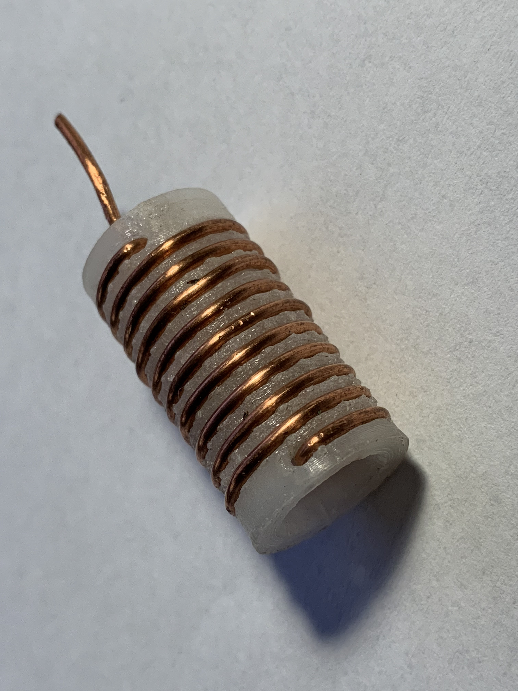

# Water Level Sensor

## Pictures

## Dimensions
The coil measures 19 mm x 30 mm.

## Print Settings
Print both parts in PETG at 0.2 mm layer height with 100% infill. Due to the
threads, it might not be as smooth as rendered, but that can be cleaned easily.