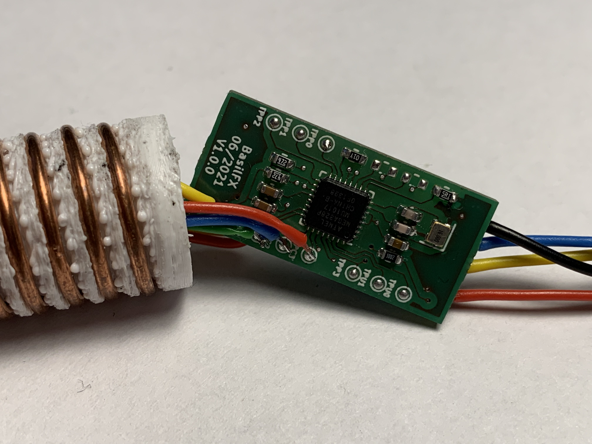

# Water Level Sensor
Capacitive water level sensor based on a custom Arduino-based board.

## Introduction
This project started as an experiment to see if a water level sensor (with
fixed intervals) could be built, using the Arduino
[ADCTouch](https://github.com/martin2250/ADCTouch) library and capacitive
sensors. Capacitive sensors have the advantage that they can be isolated from
water, creating a water-tight sensor.

In this repository, you can find the CAD designs, firmware and 3D printed
parts to create a water level sensor.

## Features
* Small board that finds in a 19mm tube.
* 4 channels/board, can be daisy-chained up to 8 boards.
* I2C connection.
* Temperature sensor.

## Contents
* The `3d/` folder contains a 3D-printable designs for the necessary parts.
* The `applications/` folder contain applications and drivers that can interact
  with the sensor.
* The `firmware/` folder contains the Platform.IO-based firmware that runs on
  the sensors.
* The `pcb/` folder contains the Kicad schema and board design.

## My setup
Several proof of concepts have been built, to validate the idea and the
sensitivity of the setup in a 19mm PVC pipe (electrical conduit pipe). This
pipe was perfect for my 400 liter rain barrel, only occupying 0.5 L of water.

To create the fixed intervals, I 3D printed coils that I wound using 1.5 mm²
electrical wire. I could not get copper/aluminium tube that fitted exactly in
the 19mm tube, and this 'solution' somewhat expands against the inside of the
tube, ensuring as little as possible air between the tube and the coil.

In total, I used 4 sensor boards, connecting a total of 16 intervals, or
25 liter per interval. The picture below shows render of how one sensor board
is used for four intervals. Four of these assemblies are daisy-chained
together. The parent board is then connected to an external application to
read the sensor.

## License
The work in this repository is covered by CC BY-NC-SA 4.0. See the `LICENSE.md`
file for more information.

Some parts of this project are covered by a different license.
