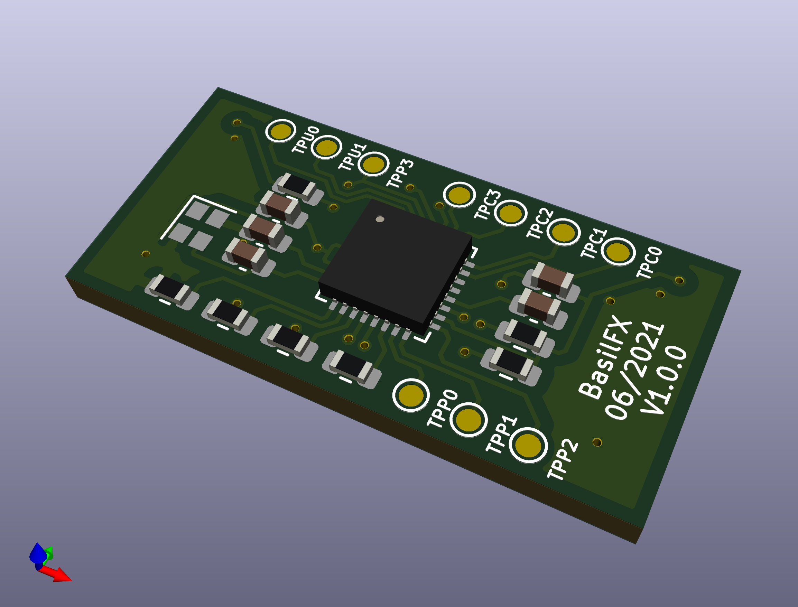
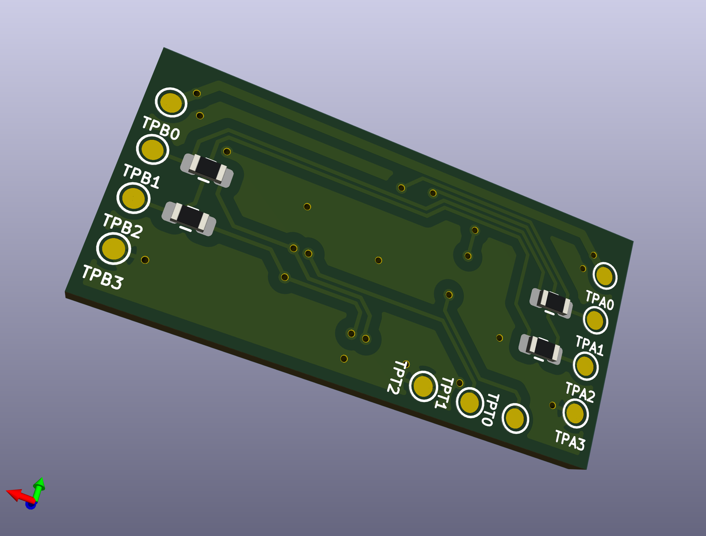
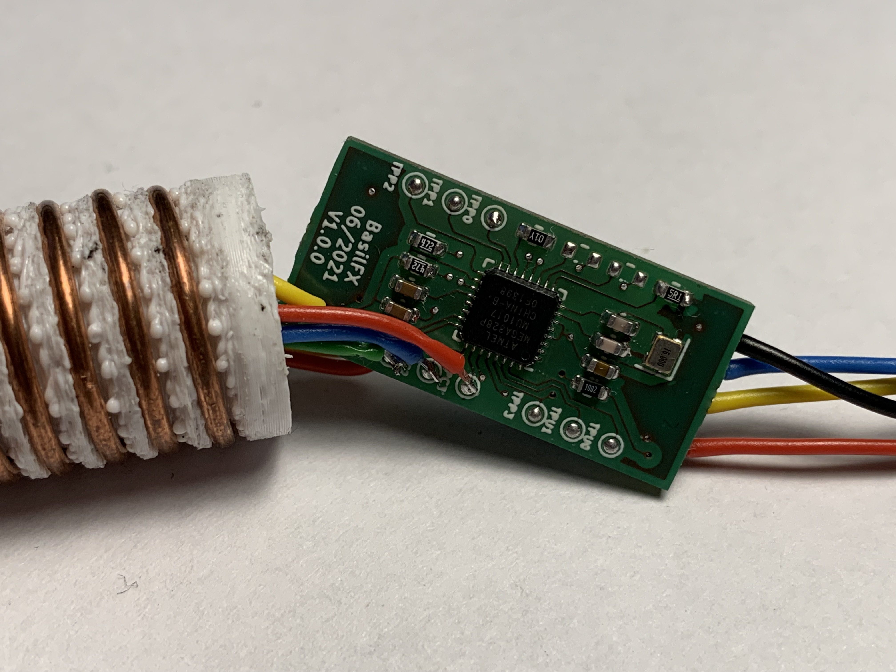
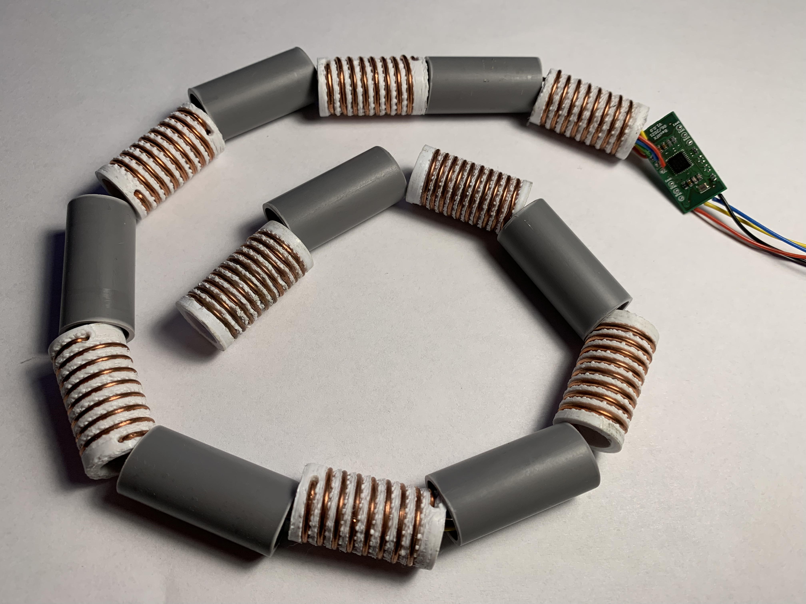

# Water Level Sensor

## Pictures
[](Pictures/TopView.png)
[](Pictures/BottomView.png)

[](Pictures/Image1.jpg)
[](Pictures/Image2.jpg)

## Schema
You can find the schema [here](Water-Level-Sensor.pdf).

## Mode of operation
The same board can operate in two modes:

* Parent mode
* Child mode

A chain of sensors (maximum of 7 + 1 sensors) exists out of one parent and zero
or more children. The parent will be the interface to the external application.
All children can be daisy-chained together.

```
[Application} <--> [Parent} <--> [Child 1] <--> [Child 2] <--> [Child 3]
```

Depending on the mode of operation, resistors R7-R10 must be populated
accordingly. All children are connected using a separate I2C bus.

The firmware uses R1-R3 and R11 for configuration. As of writing, the following
jumper resistors must be placed for the specific mode of operation.

| R1 | R2 | R3 | R11 | Description
|----|----|----|-----|--------------------------|
|    |    |    | X   | Parent mode, no children |
| X  |    |    | X   | Parent mode, 1 child     |
|    | X  |    | X   | Parent mode, 2 children  |
| X  | X  |    | X   | Parent mode, 3 children  |
|    |    |    |     | Child mode, first child  |
| X  |    |    |     | Child mode, second child |
|    | X  |    |     | Child mode, third child  |
| X  | X  |    |     | Child mode, fourth child |

## BOM
| Ref  | Value         | Footprint                                           | Farnell | DigiKey | Notes            |
|------|---------------|-----------------------------------------------------|---------|---------|------------------|
| C1   | 1µF           | Capacitor_SMD:C_0603_1608Metric                     |         |         |                  |
| C2   | 100nF         | Capacitor_SMD:C_0603_1608Metric                     |         |         |                  |
| C3   | 100nF         | Capacitor_SMD:C_0603_1608Metric                     |         |         |                  |
| C4   | 15pF          | Capacitor_SMD:C_0603_1608Metric                     |         |         |                  |
| C5   | 15pF          | Capacitor_SMD:C_0603_1608Metric                     |         |         |                  |
| R1   | 0             | Resistor_SMD:R_0603_1608Metric                      |         |         |                  |
| R2   | 0             | Resistor_SMD:R_0603_1608Metric                      |         |         |                  |
| R3   | 0             | Resistor_SMD:R_0603_1608Metric                      |         |         |                  |
| R4   | 10K           | Resistor_SMD:R_0603_1608Metric                      |         |         |                  |
| R5   | 4K7           | Resistor_SMD:R_0603_1608Metric                      |         |         |                  |
| R6   | 4K7           | Resistor_SMD:R_0603_1608Metric                      |         |         |                  |
| R7   | 0             | Resistor_SMD:R_0603_1608Metric                      |         |         | Parent-mode only |
| R8   | 0             | Resistor_SMD:R_0603_1608Metric                      |         |         | Parent-mode only |
| R9   | 0             | Resistor_SMD:R_0603_1608Metric                      |         |         | Child-mode only  |
| R10  | 0             | Resistor_SMD:R_0603_1608Metric                      |         |         | Child-mode only  |
| R11  | 0             | Resistor_SMD:R_0603_1608Metric                      |         |         |                  |
| U1   | ATmega328P-MU | Package_DFN_QFN:QFN-32-1EP_5x5mm_P0.5mm_EP3.1x3.1mm |         |         |                  |
| Y1   | 16MHz         | Crystal:Crystal_SMD_2016-4Pin_2.0x1.6mm             |         |         |                  |